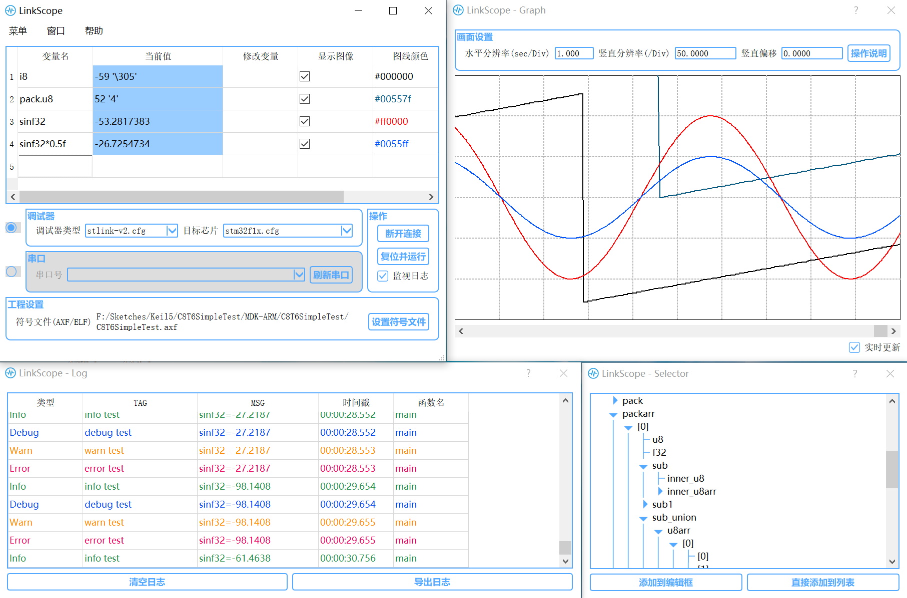

# LinkScope

---

## 项目简介

本程序使用QT编写，用于硬件设备的调试，可直接驱动串口或各种调试器（基于OpenOCD支持），有以下几个主要特性

* 主要功能

	* **实时查看**和**修改**变量值

	* 变量值**波形实时绘制**

	* **采样数据导出**到CSV表格

	* 格式化**日志**输出

* 调试器模式理论上支持OpenOCD允许GDB连接的各种调试器及硬件芯片，如STLink、JLink、CMSIS-DAP等以及STM32全系列等

* 调试器模式下采样最高约100Hz，串口模式约80Hz

* 图形化变量选择器

> 目前进行了以下设备的测试
> 调试器：STLink、CMSIS-DAP
> 目标芯片：STM32F103RCT6、STM32F103C8T6

---

## 使用方法

1. 若使用串口连接，需先将串口下位机程序移植到目标芯片中 [串口移植说明](lower/serial/README.md)

2. 若使用日志功能，需先将日志下位机程序移植到目标芯片中[日志移植说明](lower/log/README.md)

> 注：串口与日志功能不冲突，可以同时使用

3. 点击设置符号文件，添加变量

	* 加载符号文件后即可在变量选择窗口添加需要查看的变量，可以直接添加到列表或添加到编辑框后进行手动编辑

	* 在主窗口表格最后一行变量名（编辑框）处手动填写也可以添加变量

	* 在主窗口中选中变量名按Del键可删除变量

	* 变量名不仅可以填入单个变量名，还可以填入合法的C语言表达式（GDB支持即可）；复合类型不能修改和绘图，只能实时查看

4. 选择连接模式，连接芯片，连接后程序开始循环采样

	* 调试器模式下，在下拉框中选择调试器和芯片类型，点击连接目标

	* 串口模式下，点击刷新串口加载串口列表，选中所连接的串口，点击连接目标

5. 编辑`修改变量`列可以修改变量值，双击`图线颜色`列可以选择绘图颜色

6. 单击`变量名`列选中对应的变量，绘图窗口会加粗绘制波形，左下角会显示当前值和查看值（拖动鼠标进行查看）

7. 绘图界面说明可以在绘图窗口点击操作说明查看，滚轮配合`Ctrl`、`Shift`、`Alt`可以实现画面的缩放和移动

---

## 主要菜单项说明

* `刷新连接配置`：连接配置文件位于`openocd/share/openocd/scripts`下的`target`和`interface`中，用户可按照OpenOCD语法编写配置脚本，放入对应目录下，然后点击该菜单项将配置文件加载到下拉选框中

* `保存配置`：软件中所配置的连接模式、调试器型号、芯片型号、符号文件路径和各变量的配置都可以通过该菜单项保存到一个配置文件中

* `导入配置`：将上述保存的配置文件重新载入软件中

* `导出数据`：将获取到的各变量采样数据导出到CSV表格文件

---

## 使用注意事项

* 若不指定符号文件，无法使用变量名，只能通过绝对地址进行查看

* 修改符号路径后需要重新连接

* 本程序不带下载功能，连接目标前请确认已为目标芯片下载过指定程序；若更换为不同类型的调试器，即使芯片程序没有变动，也应使用更换后的调试器再次下载程序

* 下位机程序应使用与上位机同时发行的版本，更新上位机软件后应同时更新下位机程序

---

## 已知问题及解决方法

* 若程序在调试器连接模式下发生错误闪退，可能在下次运行时无法成功连接目标，可以尝试手动查找`openocd.exe`进程并强制结束

* 串口模式下从地址0读取单个字节结果恒为0，若要读取地址0可以使用大于1字节的类型

---

## 其他说明

* 关于采样速度

	* 采样速度与CPU占用率、添加的变量数量、日志输出频率等因素相关，程序会以尽可能高的速度进行采样

	* 简介中介绍的采样速度是在`i5-8265U`CPU接近空载时，添加单个变量并关闭日志的情况下测试得到的

	* 调试器模式下获取单条日志用时约50ms，串口模式约90ms，获取过程中无法进行采样，若日志数量较多则会对采样速度造成较大影响

---

## TODO

* 增加对不同文件中同名变量的区分

* 提升采样频率

* 增加对本地程序的支持

---

## 运行过程简介

* 调试器模式下，连接目标时，程序会在后台启动OpenOCD进程进行连接，并命令GDB进程连接到OpenOCD；串口模式下，OpenOCD被替换为一个Tcp服务器用于解析GDB指令并收发串口数据

* 运行过程中程序会不断模拟与GDB进程进行命令行交互，在用户添加变量时使用`display expr`指令将变量添加到GDB的查看表中，同时定时10ms发送`display`指令并进行正则解析，更新用户界面

* 程序开有一个微秒级定时器，每收到一个变量采样数据时，会从该定时器获取当前的时间戳并与数据一起记录下来，同时绘图窗口会不断对历史数据进行更新绘图

* GDB不支持符号文件路径中含有非ASCII字符，因此在连接GDB前会将指定符号文件复制到GDB目录下并用相对路径读取，断开连接时删除临时文件

* 变量选择窗口另开有一个GDB进程用于解析符号文件，内部使用树形结构存储各级变量信息，在用户每展开一级树形图时使用`info variables`、`whatis`、`ptype`指令从GDB获取下一级变量类型信息并用正则表达式解析

* 日志下位机程序会创建一个缓冲区队列，下位机会将日志输出到缓冲区中，程序会定时使用GDB的print指令将日志出队并解析显示出来

---

## 仓库文件说明

* `lower`目录下为下位机程序

* 编译QT程序后需要将`gdb`和`openocd`目录复制到可执行文件同级目录下
