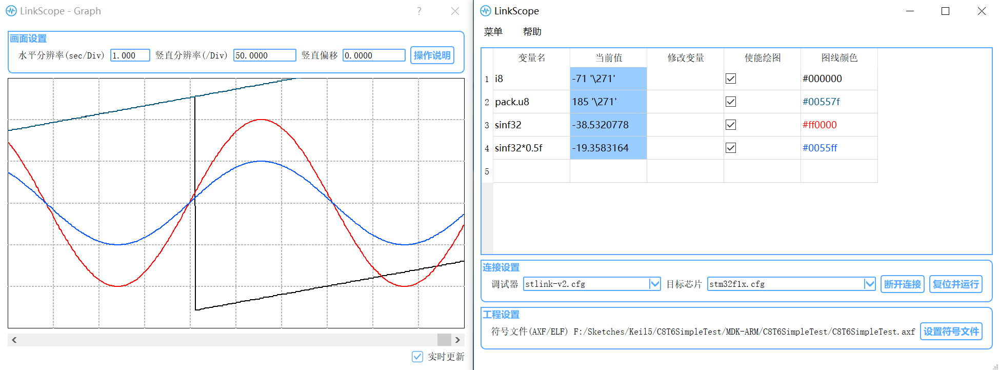
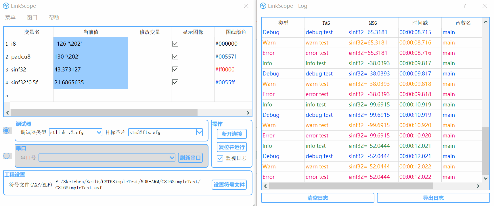
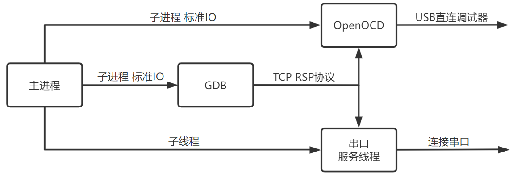

# LinkScope

**[简体中文](README.md) | English**

---

## Project Introduction

This program is developed using QT and is used for hardware device debugging. It can directly drive serial ports or various debuggers (based on OpenOCD support).

**Main Features**

* Real-time viewing and modifying variable values

* Real-time plotting of variable value waveforms

* Exporting sample data

* Formatted log output

**Connection Modes**

* Debugger Mode: The software directly drives the debugger to read target chip data.

	* No need to modify the target chip program

	* In theory, it supports various debuggers and hardware chips supported by OpenOCD, such as STLink, JLink, CMSIS-DAP, and STM32 series.

		> OpenOCD Official Documentation: [Supported Debuggers](https://openocd.org/doc/html/Debug-Adapter-Hardware.html), [Supported Chips](https://openocd.org/doc/html/CPU-Configuration.html#Target-CPU-Types)

	* For chips that require dedicated OpenOCD drivers (such as ESP32C3), you can manually start the OpenOCD process externally before connecting.

	* The maximum sampling rate is approximately 100Hz.

* Serial Port Mode: The software communicates with the target chip through a serial port.

	* A certain program needs to be ported to the target chip.

	* It can support almost all chips with serial ports.

	* The maximum sampling rate is approximately 80Hz.



---

## Usage

1. If using serial port connection or needing to use the log function, you need to first port the corresponding lower-level program to the target chip.

	> Please refer to [Serial Port Porting Instructions](lower/serial/README.md) and [Log Porting Instructions](lower/log/README.md)

	> Note: Serial port and log functions do not conflict and can be used simultaneously.

2. Download the latest release, unzip it, and double-click `LinkScope.exe` to run the program.

3. Click on "Set Symbol File" and then set the variables to be viewed.

	* Adding Variables:

		* Add them in the variable selection window (you need to set the symbol file first).

		* Manually fill in the variable name in the last row of the main window table.

	* Deleting Variables:

		* Right-click on the variable name.

		* Click on the variable name to select it and press the Del key.

	> Note: The added variable names can be any valid C language expression. For advanced usage, you can refer to [Advanced Usage Instructions](#advanced-usage-instructions); complex types like structures can only be viewed and cannot be modified or plotted.

4. Choose the connection mode, connect to the chip, and after successful connection, the program will start sampling.

	* In Debugger Mode, select the debugger and chip type in the drop-down box, and click "Connect Target." Alternatively, check "External Process" to connect directly to a running OpenOCD process.

	* In Serial Port Mode, click "Refresh Serial Ports" to load the serial port list, select the connected serial port, and click "Connect Target."

5. Edit the `Modify Variable` column to modify variable values, and double-click the `Graph Color` column to choose plot colors.

6. Click on the `Variable Name` column to select the corresponding variable. The graph window will display the waveform in bold, and the lower-left corner will show the current value and the viewing value (drag the mouse to view).

7. In the graph window, use the scroll wheel in combination with `Ctrl`, `Shift`, and `Alt` to zoom and pan the view.




---

## Main Menu Items Explanation

* `Refresh Connection Configuration`: If you have created your own configuration file, you can use this menu item to load the configuration file into the drop-down box. Please refer to [Advanced Usage Instructions](#advanced-usage-instructions).

* `Save Configuration`: All configuration settings, including connection mode, debugger model, chip model, symbol file path, and variable configurations, can be saved to a configuration file using this menu item.

* `Import Configuration`: Reloads the saved configuration file back into the software.

* `Export Data`: Exports the sampled data of various variables to a CSV table file.

* `Advanced Settings`: Opens the advanced settings window, where you can configure serial port parameters, sampling frequency, GDB port, etc.

---

## Advanced Usage Instructions

* You can enter any C language expression supported by GDB in the variable name field.

	Assuming the target program `main.c` has the following global variables:

	```c
	static int g_int = 0; // Static global variable
	int g_arr[10] = {0}; // Global array
	struct Pack {
		int var1,var2;
	} g_pack = {0}; // Global structure variable
	```

	You can use variable names for the following queries:

	```c
	g_int // View the value of the variable g_int
	&g_int // View the address of g_int
	g_pack.var1 // View the value of the member variable var1 in g_pack
	g_pack.var1+g_pack.var2 // Sum of two variables
	p_arr[0] or *g_arr // View the first element of the g_arr array
	g_pack // View the entire structure (cannot plot)
	g_arr[2]@3 // View g_arr[2] to g_arr[4] (cannot plot)
	'main.c'::g_int // Specify to view g_int in the main.c file
	*(int*)0x20005c5c // View an int data at address 0x20005c5c (this method does not require setting a symbol file)
	```

* You can customize the connection in Debugger Mode by modifying the OpenOCD configuration file.

	* The configuration files are located in the `openocd/share/openocd/scripts` directory under the OpenOCD installation. You can modify or add files there.

	* The configuration syntax can be found in the [OpenOCD Official Documentation](https://openocd.org/doc/html/Config-File-Guidelines.html).

	* If you add a new configuration file, you can use the `Refresh Connection Configuration` menu item to load it into the software's drop-down box.

---

## Usage Notes

* Without specifying a symbol file, you cannot use variable names and can only view by absolute address.

* After modifying the symbol file path, you need to reconnect.

* This program does not have a download function. Please make sure to have downloaded the specified program to the target chip before connecting. If you change to a different type of debugger, even if the chip program has not changed, you should download the program again using the changed debugger.

* The lower-level program should use the version distributed together with the upper-level software. After updating the upper-level software, you should also update the lower-level program.

---

## Known Issues and Solutions

* If the program crashes in Debugger Mode and fails to connect to the target in the next run, you can try manually finding the `openocd.exe` process and forcibly terminating it.

* In Serial Port Mode, reading a single byte from address 0 always results in 0. To read address 0, use a type larger than 1 byte.

---

## Other Information

**Sampling Speed**

* The sampling speed is related to CPU usage, the number of added variables, log output frequency, etc. The program will sample at the highest possible speed.

* The sampling speed mentioned in the introduction was tested on an `i5-8265U` CPU under nearly idle conditions, with a single variable added and the log closed.

* In Debugger Mode, it takes about 50ms to get a single log, and in Serial Port Mode, it takes about 90ms. The sampling process cannot proceed during log acquisition, and if there are many logs, it will significantly impact the sampling speed.

**Supported Devices**

* Although theoretically supports all devices supported by built-in OpenOCD, due to various factors, it may still not work on some devices.

* Currently tested devices include:

	* Debuggers: STLINK-V2, CMSIS-DAP

	* Target Chips: STM32F103RCT6, STM32F103C8T6, STM32F407ZGT6, STM32F407IGH6, ESP32C3 (built-in JTAG + [dedicated OpenOCD](https://github.com/espressif/openocd-esp32))

---

## Development Notes

> Note: If you wish to contribute, you can read this section. If you only need to use the software, you can skip it.

**Development Environment**

* IDE: Qt Creator

* QT Version: 5.9.9

**Running Process Overview**

* In Debugger Mode, when connecting to the target, the program will start an OpenOCD process in the background for the connection and command the GDB process to connect to OpenOCD. In Serial Port Mode, OpenOCD is replaced by a TCP server to parse GDB's RSP commands and exchange serial port data.

	

* During the running process, the main process communicates with the GDB process via standard input/output. When a variable is added, the `display expr` command is used to add the variable to GDB's watchlist, and the program sends the `display` command at regular intervals (every 10ms) to update the user interface by regular expression parsing.

* The program has a microsecond-level timer. When receiving a variable sampling data, it records the current timestamp from the timer and updates the historical data for plotting in the graph window.

* GDB does not support non-ASCII characters in the symbol file path. Therefore, before connecting to GDB, the specified symbol file is copied to the GDB directory and read using a relative path. The temporary file is deleted when disconnecting.

* The variable selection window runs another GDB process internally to parse the symbol file. It stores the variable information in a tree structure, and when the user expands one level of the tree, it uses the `info variables`, `whatis`, and `ptype` commands to get the next level of variable type information from GDB and parse it using regular expressions.

* The log lower-level program creates a buffer queue, and the lower-level program outputs logs to the buffer. The program uses the GDB print command to dequeue and parse logs for display at regular intervals.

**Repository File Description**

* `mainwindow.cpp/h`: Main window

* `graphwindow.cpp/h`: Graph window

* `listwindow.cpp/h`: Variable selection window

* `logwindow.cpp/h`: Log window

* `aboutwindow.cpp/h`: About window

* `helpwindow.cpp/h`: Help window

* `openocd.cpp/h`: OpenOCD process control

* `serialocd.cpp/h`: Serial port server logic, responsible for receiving GDB's TCP connection and connecting to the lower-level program through the serial port

* `gdbprocess.cpp/h`: GDB process control and output parsing

* `vartype.h`: Variable-related data type definitions

* `qss`: QSS style file

* `gdb`/`openocd`: gdb and openocd executables and configuration files, not involved in compilation, need to be manually placed in the same directory as the executable after compilation

* `lower/log`/`lower/serial`: Lower-level program code

**TODO**

* Increase the sampling frequency

* Add support for local programs
